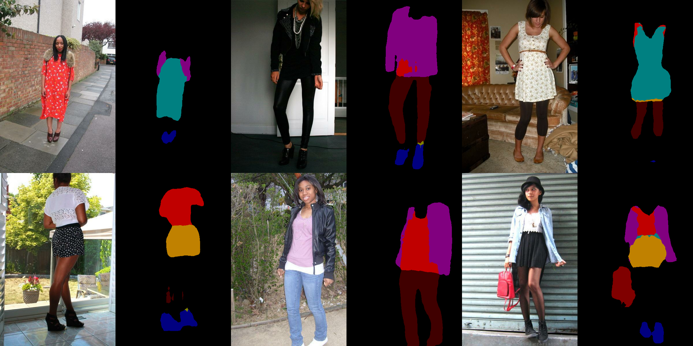
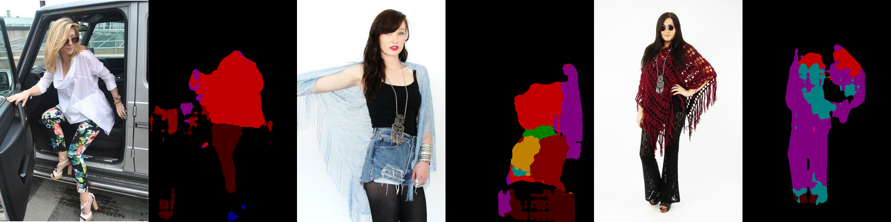

# Modanet-DeeplabV3-MobilenetV2-Tensorflow
Training tf based DeeplabV3 - MobilenetV2 model on the [modanet dataset](https://github.com/eBay/modanet).


## Prerequisite
- python >= 3.6
- tensorflow >= 1.15.0


## Installation
1. Install tensorflow models following the [official tutorial](https://github.com/tensorflow/models/blob/master/research/delf/INSTALL_INSTRUCTIONS.md).
2. Fetch the source code and head to the project directory.
```bash
git clone https://github.com/McDo/Modanet-DeeplabV3-MobilenetV2-Tensorflow.git
cd ./Modanet-DeeplabV3-MobilenetV2-Tensorflow
```


## Data Preparation
ModaNet is a granularly annotated street fashion dataset based on images in the [PaperDoll image set](https://github.com/kyamagu/paperdoll/tree/master/data/chictopia). It has 55,176 images with pixel-level segments, polygons and bounding boxes covering 13 categories. 

This project uses the refined version of ModaNet that fixed the bounding box overlapping issue by [Pier Carlo Cadoppi](https://github.com/cad0p), you can download the dataset from [cad0p/maskrcnn-modanet](https://github.com/cad0p/maskrcnn-modanet/releases).

Here is the recommended directory structure for training and validation:
```
+ /PATH/TO/MODANET_DATASET
    + images
        + train
        + val
    + annotations
        - instances_train.json
        - instances_val.json
```

### Convert from coco format data to voc format for deeplab training

1. conversion
```bash
cd deeplab/datasets/coco2voc
python main.py --dataset /PATH/TO/MODANET_DATASET
```
The generated VOC format data would reside in `/PATH/TO/MODANET_DATASET/voc`.

2. remove gt colormap
```bash
python remove_gt_colormap.py --dataset /PATH/TO/MODANET_DATASET
```

3. display samples from train/val dataset
```bash
python sample.py --dataset /PATH/TO/MODANET_DATASET --mode train
```

### Build tf-record data

1. beforehand, you need to copy(move) all of your images inside `/PATH/TO/MODANET_DATASET/train` and `/PATH/TO/MODANET_DATASET/val` to the `/PATH/TO/MODANET_DATASET/voc/JPEGImages`.

2. build tf-record
```bash
cd deeplab/datasets
```
```bash
python build_modanet_data.py \
	--image_folder="/PATH/TO/MODANET_DATASET/voc/JPEGImages" \
	--semantic_segmentation_folder="/PATH/TO/MODANET_DATASET/voc/SegmentationClassRaw" \
	--list_folder="/PATH/TO/MODANET_DATASET/voc/ImageSets/Segmentation" \
	--image_format="jpg" \
	--output_dir="/PATH/TO/TFRECORD_DIR"
```

### Register the modanet dataset 

There are some minor changes to the `deeplab/datasets/data_generator.py` for dataset registration.

```python
# line 111:
_MODANET_SEG_INFORMATION = DatasetDescriptor(
    splits_to_sizes={
        'train': 52377,   # num of samples in images/training
        'val': 2799,      # num of samples in images/validation
        'trainval': 55176 # num of samples train+val
    },
    num_classes=14, # 13 classes + background
    ignore_label=255
)

# line 120:
_DATASETS_INFORMATION = {
    'cityscapes': _CITYSCAPES_INFORMATION,
    'pascal_voc_seg': _PASCAL_VOC_SEG_INFORMATION,
    'ade20k': _ADE20K_INFORMATION,
    'modanet_seg': _MODANET_SEG_INFORMATION,
}
```
Fill out the number of `train`, `val` and `trainval` for your own needs.


## Training Process

```bash
cd deeplab
```

- Training
```bash
python train.py \
    --logtostderr \
    --training_number_of_steps=30000 \
    --train_split="train" \
    --model_variant="mobilenet_v2" \
    --train_crop_size="513,513" \
    --train_batch_size=8 \
    --dataset="modanet_seg" \
    --fine_tune_batch_norm=True \
    --tf_initial_checkpoint=./deeplabv3_mnv2_pascal_trainval_2018_01_29/model.ckpt \
    --train_logdir=./train_logdir \
    --dataset_dir=./tfrecord \
    --initialize_last_layer=False \
    --last_layers_contain_logits_only=False
```

- Validation
```bash
python eval.py \
    --logtostderr \
    --eval_split="val" \
    --model_variant="mobilenet_v2" \
    --eval_crop_size="601,401" \
    --dataset="modanet_seg" \
    --output_stride=8 \
    --checkpoint_dir=./deeplabv3_mnv2_pascal_trainval_2018_01_29/trained \
    --eval_logdir=./eval_logdir \
    --dataset_dir=./tfrecord
```

**NOTE**

> i. For `mobilenetv2_dm05` model, change the `depth_multiplier` FLAG to `0.5` in `common.py`, else change it back to 1.0.

> ii. If custom dataset is used for training but want to reuse the pre-trained feature encoder, try adding
```
--initialize_last_layer=False
--last_layers_contain_logits_only=False
``` 

> iii. When fine_tune_batch_norm=True, use at least batch size larger than **12** (batch size more than **16** is better). Otherwise, one could use smaller batch size and set fine_tune_batch_norm=False.

> iv. When running `python train.py` in colab, using `!python` instead of `%%bash python`, otherwise the notebook wouldn't print anything out.

> v. We always set crop_size = output_stride * k + 1, where k is an integer. When working on PASCAL images, the largest dimension is 512. Thus, we set crop_size = 513 = 16 * 32 + 1 > 512. Similarly, we set eval_crop_size = 1025x2049 for Cityscapes images.


## Results

You may visualize the validation results by running
```bash
python vis.py \
    --logtostderr \
    --eval_split="val" \
    --model_variant="mobilenet_v2" \
    --vis_crop_size="601,401" \
    --dataset="modanet_seg" \
    --output_stride=8 \
    --checkpoint_dir="./deeplabv3_mnv2_pascal_trainval_2018_01_29/trained" \
    --vis_logdir=./vis_logdir \
    --dataset_dir=./tfrecord \
    --max_number_of_evaluations=1
```

Since the deeplab with mobilenetv2 backnone doesn't use ASPP and Decoder as the postprocessing (check out the [model zoo](https://github.com/tensorflow/models/blob/master/research/deeplab/g3doc/model_zoo.md) for details), the MIOU is relative low compared to the full version. Here are some samples from the visualization results.


<br /><br />



## References
- data source - [cad0p/maskrcnn-modanet](https://github.com/cad0p/maskrcnn-modanet)
- coco to voc - [alicranck/coco2voc](https://github.com/alicranck/coco2voc)
- deeplab data process - [tensorflow deeplab](https://github.com/tensorflow/models/tree/master/research/deeplab/datasets)


## License
[MIT](./LICENSE)